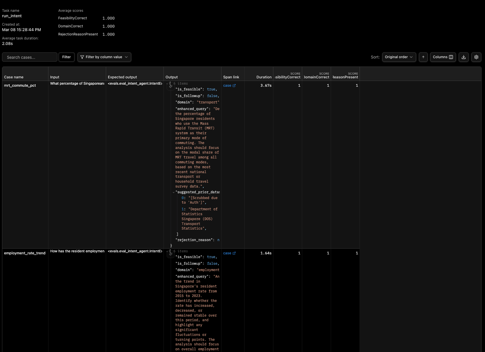

# Testing

## Strategy Overview

APDA uses three layers of testing:

1. **Unit and integration tests** (`backend/tests/`) - deterministic tests with mocked LLM calls, run on every PR.
2. **LLM evaluation tests** (`backend/evals/`) - live LLM calls scored against quality thresholds, triggered manually or on push to `main`.
3. **Frontend component tests** (`frontend/`) - Vitest + React Testing Library, run on every PR.

---

## Unit and Integration Tests

Location: `backend/tests/`

```bash
cd backend
pytest tests/ -v
```

### Test files

| File                                    | What it covers                                               |
| --------------------------------------- | ------------------------------------------------------------ |
| `test_llm_service.py`                   | LLM model selection and fallback logic                       |
| `test_extraction.py`                    | DuckDB tool functions (load, query, describe)                |
| `test_normalization.py`                 | Column reconciliation across multiple extraction results     |
| `test_analysis.py`                      | Analysis agent output structure and field validation         |
| `test_query_service.py`                 | Query initiation, SSE queue wiring, conversation lookup      |
| `test_pipeline_repository.py`           | Repository read/write against an in-memory SQLite database   |
| `test_router.py`                        | FastAPI endpoint request/response contracts                  |
| `test_coordinator_graph.py`             | Full graph smoke tests with mocked agents                    |
| `test_coordinator_graph_agents.py`      | Per-agent unit tests (intent, selector, validator, planner)  |
| `test_coordinator_graph_nodes.py`       | Individual node logic (state transitions, routing decisions) |
| `test_coordinator_graph_integration.py` | End-to-end graph runs with stubbed LLM responses             |

### Mocking strategy

All LLM calls are intercepted via `pytest` fixtures defined in `tests/conftest.py`. Agents are patched to return pre-built Pydantic model instances, keeping tests deterministic and free of API costs.

Async support is provided by `pytest-asyncio` with `asyncio_mode = "auto"` (configured in `pyproject.toml`).

---

## LLM Evaluation Tests

Location: `backend/evals/`

```bash
cd backend
pytest evals/ -v -s
```

These tests make real OpenAI API calls and score outputs against numeric thresholds using `pydantic-evals`.

### Eval 1: Intent Agent (`eval_intent_agent.py`)

**Task:** Given a natural language query, does `intent_agent` correctly classify feasibility and identify the policy domain?

**Cases:** 6 total (3 feasible, 3 infeasible)

| Case                        | Query                                                             | Expected                    |
| --------------------------- | ----------------------------------------------------------------- | --------------------------- |
| `mrt_commute_pct`           | "What percentage of Singaporeans commute by MRT?"                 | feasible, domain=transport  |
| `employment_rate_trend`     | "How has the resident employment rate changed from 2015 to 2023?" | feasible, domain=employment |
| `housing_prices_comparison` | "Compare housing prices across planning areas in 2022"            | feasible, domain=housing    |
| `joke_rejected`             | "Tell me a joke"                                                  | infeasible                  |
| `weather_rejected`          | "What is the current weather in Singapore?"                       | infeasible                  |
| `vague_singapore_rejected`  | "Tell me about Singapore"                                         | infeasible                  |

**Evaluators and thresholds:**

| Evaluator                | Threshold                        | Description                                                                               |
| ------------------------ | -------------------------------- | ----------------------------------------------------------------------------------------- |
| `FeasibilityCorrect`     | >= 0.85                          | 1.0 if `is_feasible` matches expected, else 0.0                                           |
| `DomainCorrect`          | >= 0.80                          | 1.0 if domain matches expected (case-insensitive substring); skipped for infeasible cases |
| `RejectionReasonPresent` | (no threshold, checked per-case) | 1.0 if `rejection_reason` is non-empty for infeasible queries                             |

### Eval 2: Analysis Agent (`eval_analysis_agent.py`)

**Task:** Given pre-baked normalized data, does `analysis_agent` produce quantitative, chart-ready, well-summarized output?

**Cases:** 2 total

| Case                        | Query                                                      |
| --------------------------- | ---------------------------------------------------------- |
| `transport_mode_comparison` | "Compare daily trips by transport mode"                    |
| `employment_rate_trend`     | "How has the resident employment rate trended since 2015?" |

**Evaluators and thresholds:**

| Evaluator                 | Threshold | Description                                                |
| ------------------------- | --------- | ---------------------------------------------------------- |
| `HasQuantitativeFindings` | >= 0.80   | Fraction of `key_findings` that contain at least one digit |
| `ChartCountInRange`       | >= 0.80   | 1.0 if the output contains 2-3 `chart_configs`, else 0.0   |
| `SummaryNotEmpty`         | >= 0.80   | 1.0 if `summary` contains at least 20 words, else 0.0      |

### Why pydantic-evals

- Structured `Case` and `Dataset` definitions keep eval inputs and expected outputs version-controlled alongside the code.
- Numeric `Evaluator` classes produce scores that can be asserted with thresholds in `pytest`, enabling CI failure on quality regression.
- The `report.print()` output shows per-case pass/fail detail for debugging.
- Sample pydantic eval in logfire web portal UI:
  

## Improving Answer's Quality

APDA uses several layers to prevent the LLM from fabricating answers:

**Intent gating**
`AnalyzeIntentNode` runs before any data access. Off-domain, vague, or real-time queries are rejected with an explicit `rejection_reason` before the pipeline ever touches a dataset. The `RejectionReasonPresent` evaluator asserts that the model explains refusals rather than hallucinating a plausible-sounding response.

**ValidateAnalysisNode feedback loop**
After `AnalyzeNode`, `ValidateAnalysisNode` scores the output on structure and specificity. If quality is insufficient it routes backward to `SelectDatasetsNode` or `PlanResearchNode` with a structured critique, forcing the pipeline to retry with corrected inputs rather than emitting a low-confidence answer.

**HasQuantitativeFindings evaluator**
This evaluator checks that each key finding contains at least one number. Findings that cite no data are likely fabricated or vague; this threshold ensures the analysis is grounded in the actual extracted rows.

**RejectionReasonPresent evaluator**
For infeasible queries, this evaluator enforces that the model returns a user-facing explanation rather than a hallucinated answer. A model that hallucinates an answer to a weather question instead of rejecting it would fail this check.

---

## Frontend Tests

Location: `frontend/`

```bash
cd frontend
npm test
```

- Framework: **Vitest** with `jsdom` as the test environment
- Component tests use **React Testing Library**
- Coverage: `npm test:coverage`

---

## CI/CD

| Workflow file                      | Trigger                           | What runs                                 |
| ---------------------------------- | --------------------------------- | ----------------------------------------- |
| `.github/workflows/ci-cd.yaml`     | Push / PR (path-based)            | Backend unit tests, frontend Vitest tests |
| `.github/workflows/llm-evals.yaml` | Manual dispatch or push to `main` | `pytest evals/ -v -s` (live LLM calls)    |

Path-based triggers ensure backend changes only run backend tests and frontend changes only run frontend tests, keeping CI fast.
